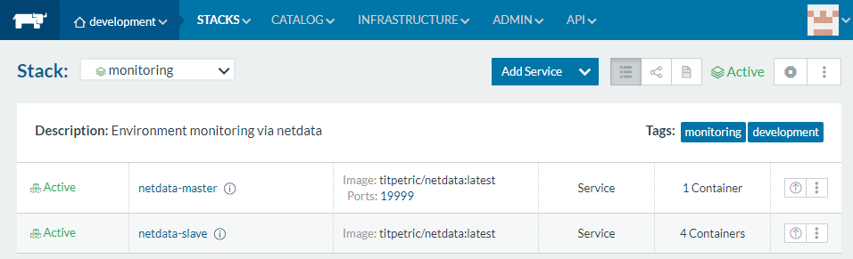
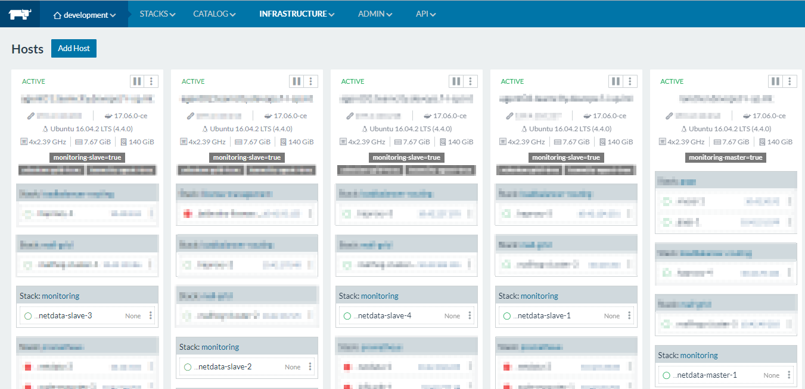

# docker-netdata-autoscale
Auto scaling netdata ephemeral nodes for monitoring a cluster of docker hosts (preferable in rancher).


For more detailed information see
* https://github.com/firehol/netdata/wiki
* https://github.com/firehol/netdata/wiki/monitoring-ephemeral-nodes
* http://rancher.com/

## Run

Just run the compose file:

```
$ docker-compose up -d .
```

## Run (in Rancher)
Just paste the two from this repository configs (`docker-compose.yml` and `rancher-compose.yml`) to your monitoring stack and fire it up. Optionally you can change the `API key` to your needs.

## Autoscaling and control
The scaling of netdata master and slave services (containers) is loosely based on labels in rancher.



A node inheriting the label `monitoring-slave = true` will start a monitoring slave (ephemeral node) and a node containing `monitoring-master`will start a master netdata (container).



 Both, master and slave containers can scale. For true autoscaling, just remove the label constraints for the `monitoring-slave = true` from the above config.
