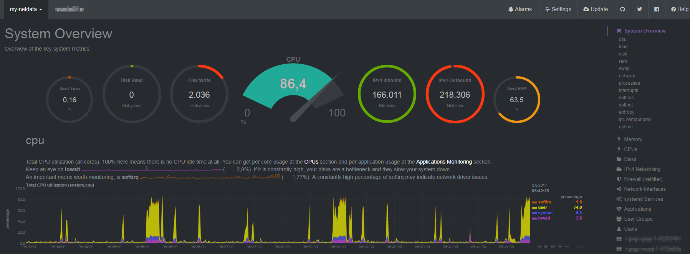

# docker-netdata-autoscale
Auto scaling netdata ephemeral nodes for monitoring a cluster of docker hosts (preferable in rancher).



For more detailed information see
* https://github.com/firehol/netdata/wiki
* https://github.com/firehol/netdata/wiki/monitoring-ephemeral-nodes
* http://rancher.com/

## Run

Just run the compose file:

```
$ docker-compose up -d .
```

## Run (in Rancher)
Just paste the two from this repository configs (`docker-compose.yml` and `rancher-compose.yml`) to your monitoring stack and fire it up. Optionally you can change the `API key` to your needs.
